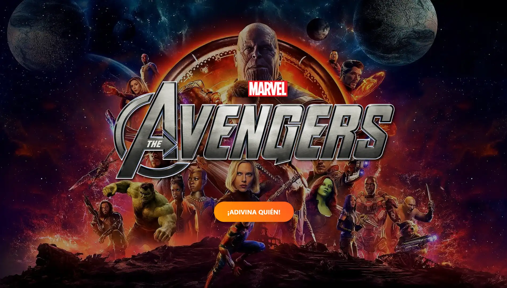
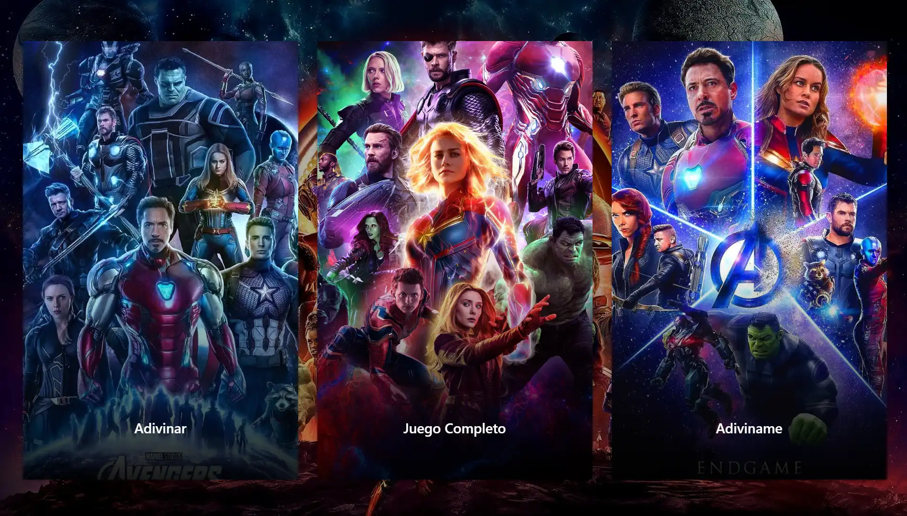
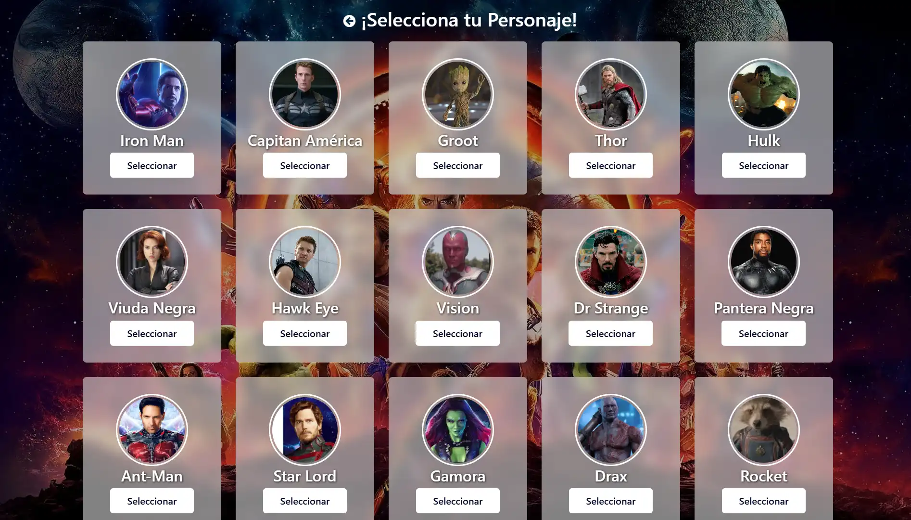
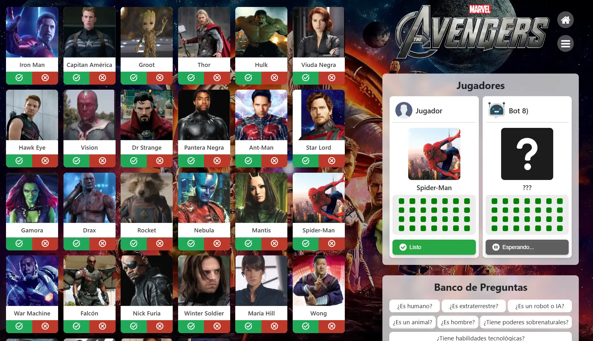
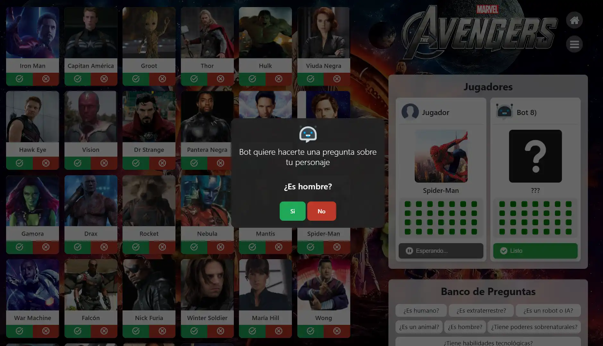

# Guess Who - Avengers Edition 🦸‍♂️🦸‍♀️

A web project inspired by the classic "Guess Who" game, featuring characters from the Avengers universe. This game is a **Single Page Application (SPA)** developed using **HTML, CSS, and JavaScript**.

---

## 📸 Screenshots


*Start screen*


*Game modes selection*


*Character selection*


*Game board*


*AI question*

---

## ✨ Features

- **Character Selection:** Choose from a variety of Avengers heroes and villains.
- **Interactive Gameplay Mode:** Answer questions to deduce your opponent's character.
- **Dynamic Animations:** Use **Lottie animations** for an immersive visual experience.
- **AI Powered by Production Rules:** Opponent decisions are programmed using a production rules system that emulates logical reasoning.

---

## 🌟 Technologies Used

- **HTML:** For structuring the webpage.
- **CSS:** For visual design and responsiveness.
- **JavaScript:** For game logic and interaction.
- **Lottie Animations:** To incorporate lightweight, high-quality animations.

---

## 🎮 How to Play

1. Start the game from the main interface.
2. Select your preferred game mode.
3. Choose your character or follow the on-screen instructions.
4. Answer system questions to narrow down options.
5. Make your best guess to identify your opponent's character!
6. Enjoy dynamic animations as you progress or win the game.

---

## 🤖 Artificial Intelligence with Production Rules

The game's artificial intelligence behavior is based on a **production rules system**, a logical approach that allows the machine to make decisions based on defined conditions. This enhances the game's strategic and interactive experience.

---

## 🚀 Installation and Execution

1. Clone this repository in VS Code:
   ```bash
   git clone https://github.com/KevinMG20/GuessWhoAvengers.git
   ```
2. Run the project using the *Live Server* extension.
3. **Have fun!**
