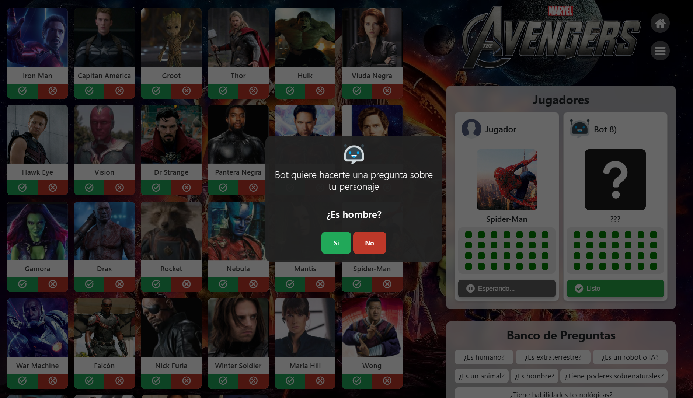

# Adivina Quién - Avengers Edition 🦸‍♂️🦸‍♀️

Un proyecto web inspirado en el clásico juego "Adivina Quién", pero con personajes del universo Avengers. Este juego es una **Single Page Application (SPA)** desarrollada utilizando **HTML, CSS y JavaScript**. 

---

## 📸 Capturas de Pantalla


*Pantalla de inicio*


*Selección de modos de juego*


*Selección de personajes*


*Tablero de juego*


*Pregunta de la IA*

_Agrega más capturas para mostrar el juego en acción._

---

## ✨ Funcionalidades

- **Selección de Personajes:** Elige entre una variedad de héroes y villanos de los Avengers.
- **Modo de Juego Interactivo:** Responde preguntas para deducir el personaje de tu oponente.
- **Animaciones Dinámicas:** Usa **Lottie animations** para una experiencia visual inmersiva.
- **IA Programada con Reglas de Producción:** Las decisiones del oponente están programadas utilizando un sistema de reglas de producción que emula un razonamiento lógico.

---

## 🌟 Tecnologías Usadas

- **HTML:** Para la estructura de la página.
- **CSS:** Para el diseño visual y responsividad.
- **JavaScript:** Para la lógica del juego y la interacción.
- **Lottie Animations:** Para incorporar animaciones ligeras y de alta calidad.

---

## 🎮 Cómo Jugar

1. Inicia el juego en la interfaz principal.
2. Selecciona tu modo de juego de prefencia.
3. Selecciona tu personaje o sigue las instrucciones que se te muestran.
4. Responde las preguntas del sistema para filtrar opciones.
5. Haz tu mejor deducción y ¡adivina quién es el personaje de tu oponente!
6. Observa las animaciones dinámicas al avanzar o ganar el juego.

---

## 🤖 Inteligencia Artificial con Reglas de Producción

El comportamiento de la inteligencia artificial del juego está basado en un sistema de **reglas de producción**, un enfoque lógico que permite a la máquina tomar decisiones a partir de condiciones definidas. Esto le da al juego una experiencia más estratégica e interactiva.

---

## 🚀 Instalación y Ejecución

1. Clona este repositorio en VS Code:
   ```bash
   git clone https://github.com/KevinMG20/GuessWhoAvengers.git
2. Corre el proyecto usando la extensión *Live Server*.
3. **¡Diviertete!**.
